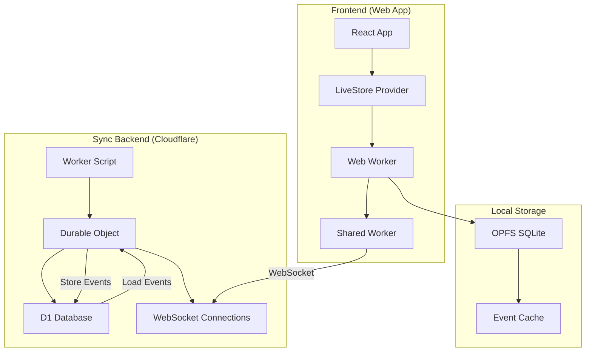

# LiveStore Sync Documentation

This documentation explains the complete LiveStore synchronization system built with Cloudflare Workers, Durable Objects, and D1 database.

## 📖 Table of Contents

1. **[Architecture Overview](./architecture.md)** - High-level system design and data flow
2. **[LiveStore Basics](./livestore-basics.md)** - Understanding LiveStore concepts and event sourcing
3. **[Sync Worker Setup](./sync-worker.md)** - Cloudflare Worker configuration and deployment
4. **[Client Configuration](./client-setup.md)** - Frontend integration and connection setup
5. **[Database Schema](./database-schema.md)** - Event store structure and queries
6. **[Development Workflow](./development.md)** - Local development and debugging
7. **[Deployment Guide](./deployment.md)** - Production deployment process
8. **[Troubleshooting](./troubleshooting.md)** - Common issues and solutions

## 🚀 Quick Start

```bash
# 1. Start all services
bun run dev

# 2. Start just the sync worker
bun run dev:sync-worker

# 3. Reset LiveStore if needed
# Visit: http://localhost:3001?reset
```

## 🏗️ System Overview



## 🎯 Key Features

- **Real-time Sync**: WebSocket connections via Cloudflare Durable Objects
- **Offline Support**: Local OPFS storage with automatic sync when online
- **Event Sourcing**: All data changes stored as immutable events
- **Multi-tab Support**: Shared workers coordinate between browser tabs
- **Type Safety**: Full TypeScript support with schema validation
- **Scalable**: Cloudflare's global edge network

## 🔧 Technologies Used

- **Frontend**: React, TypeScript, Vite
- **Sync Backend**: Cloudflare Workers, Durable Objects, D1 Database
- **Storage**: OPFS (Origin Private File System) SQLite
- **Real-time**: WebSockets with auto-reconnection
- **State Management**: LiveStore with event sourcing

## 📚 Core Concepts

### Event Sourcing
All data mutations are stored as events, not direct state updates. This provides:
- Complete audit trail
- Time-travel debugging
- Conflict-free merging
- Reliable sync between clients

### Durable Objects
Cloudflare Durable Objects provide:
- Single source of truth per store
- WebSocket connection management
- Strong consistency guarantees
- Automatic scaling and persistence

### OPFS Storage
Origin Private File System provides:
- High-performance local SQLite
- Persistent storage across sessions
- No size limits (unlike localStorage)
- Worker-safe file system access

---

For detailed information, explore the individual documentation files linked above. 