# Architecture Overview

This document explains the complete architecture of the LiveStore synchronization system.

## 🏗️ High-Level Architecture

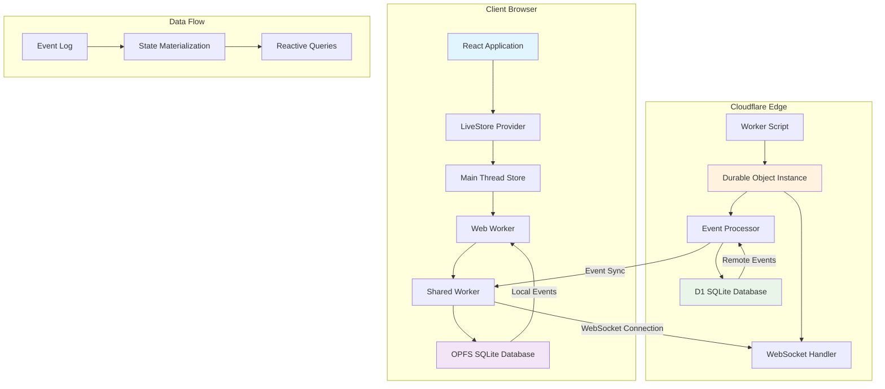

## 🔄 Data Flow Architecture

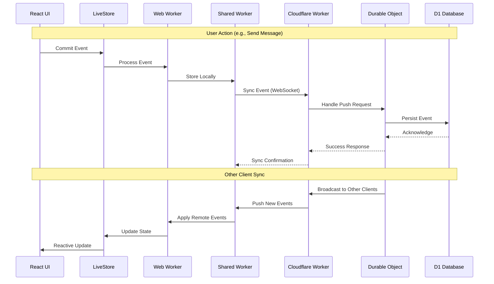

## 🧩 Component Breakdown

### Frontend Architecture

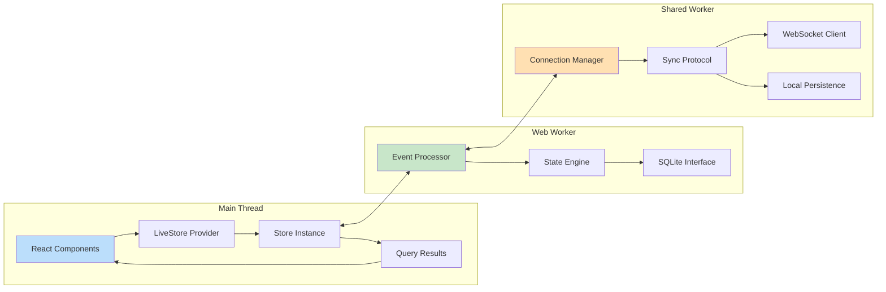

### Backend Architecture

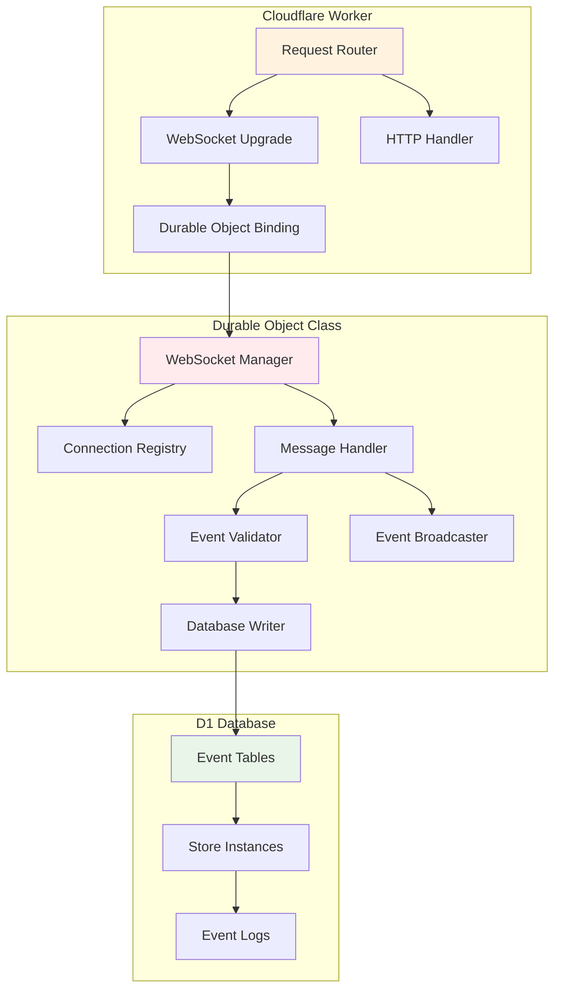

## 📊 Data Architecture

### Event Sourcing Model

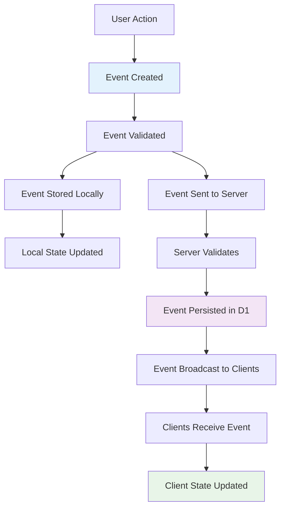

### Database Schema

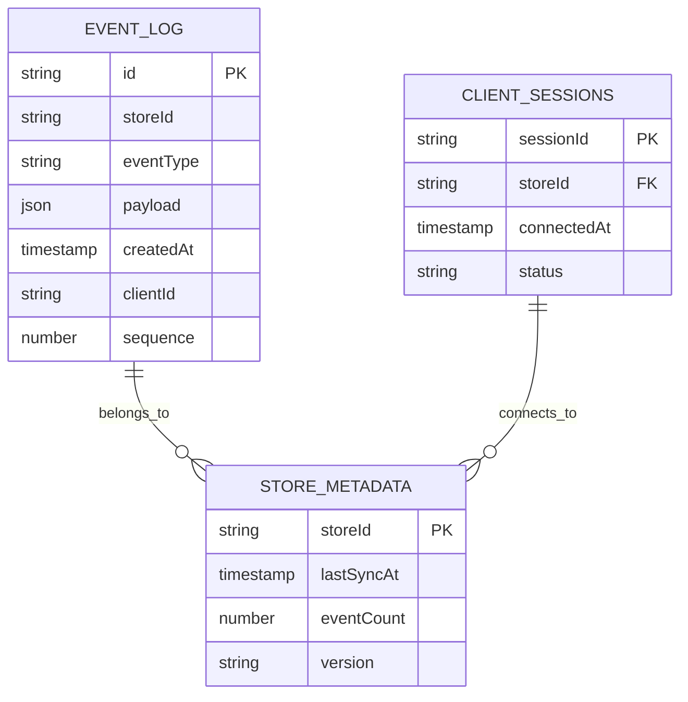

## 🔧 Sync Protocol

### Connection Lifecycle

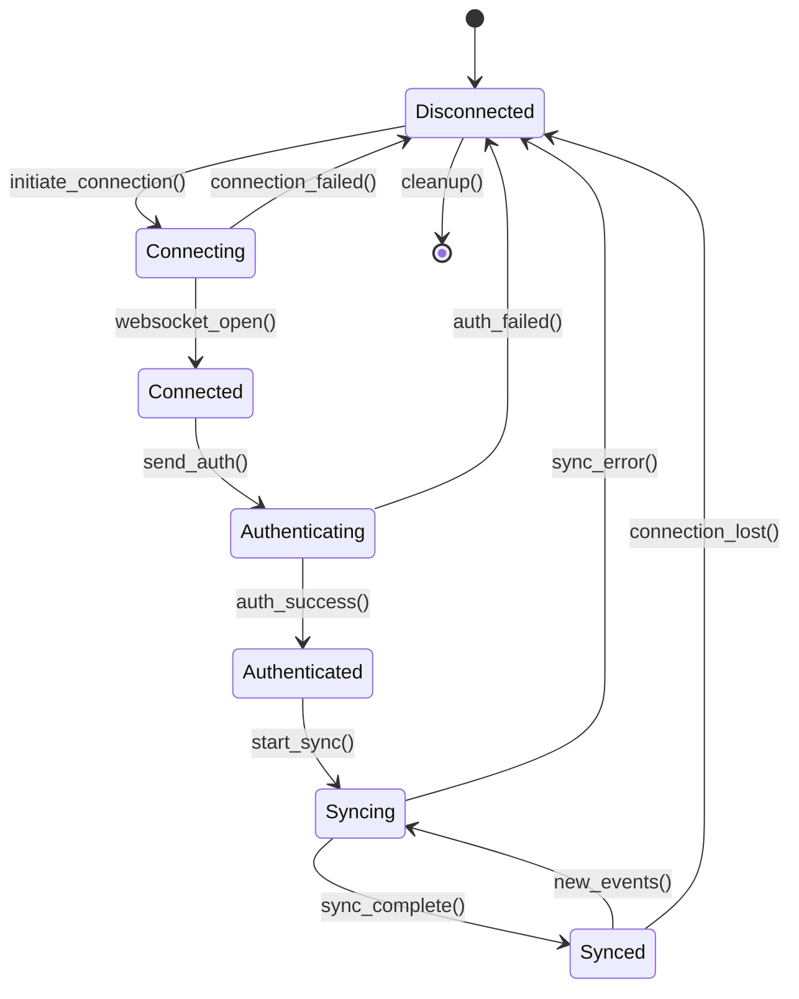

### Message Protocol

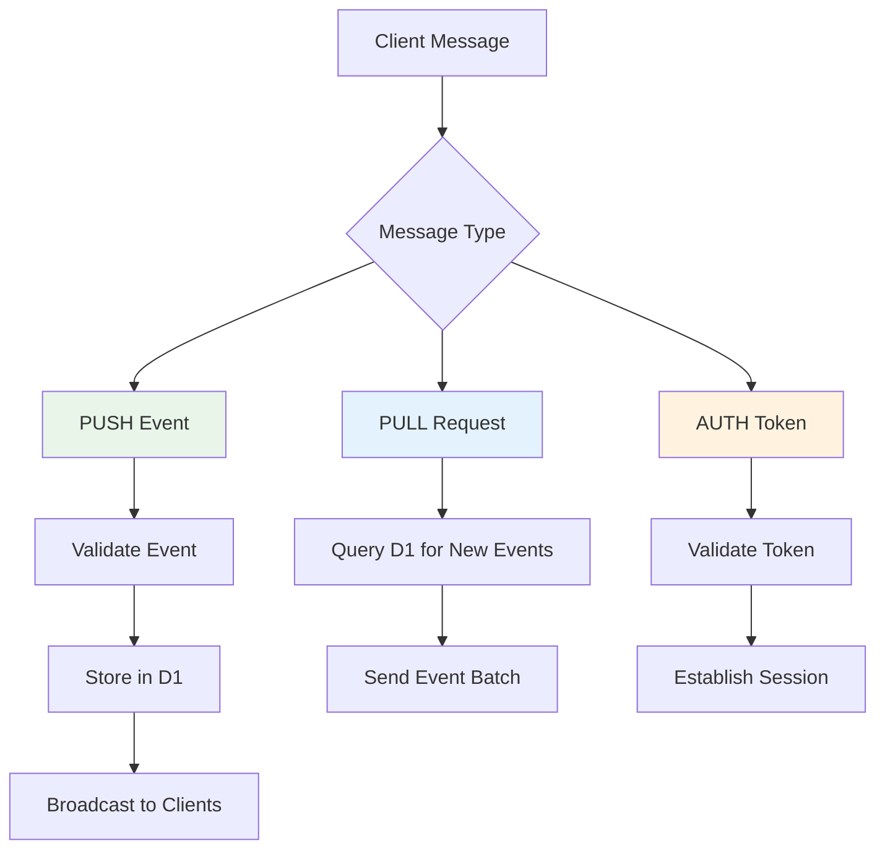

## 🌐 Network Architecture

### Global Distribution

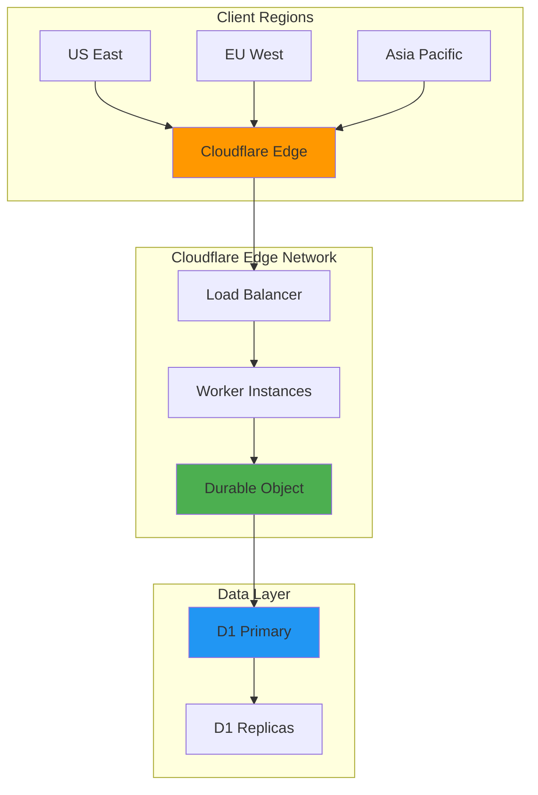

## 🔐 Security Architecture

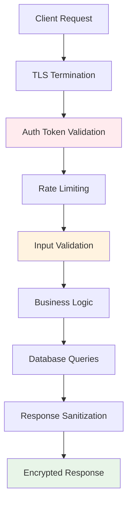

## 📈 Scalability Considerations

### Horizontal Scaling

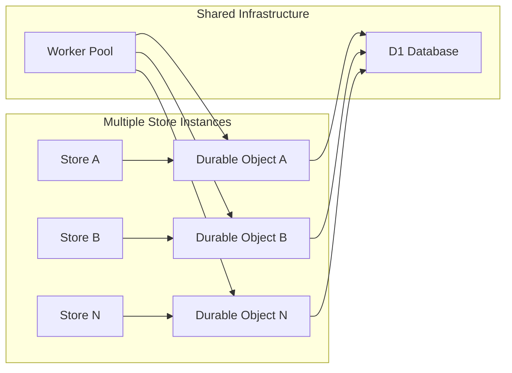

### Performance Optimization

- **Connection Pooling**: Shared workers manage WebSocket connections
- **Event Batching**: Multiple events sent together to reduce network calls
- **Local Caching**: OPFS provides fast local storage with no network latency
- **Edge Computing**: Cloudflare's global network reduces RTT
- **Efficient Queries**: SQLite materialized views for fast data access

---

This architecture provides a robust, scalable, and real-time synchronization system that works across multiple clients while maintaining data consistency and offline capabilities. 