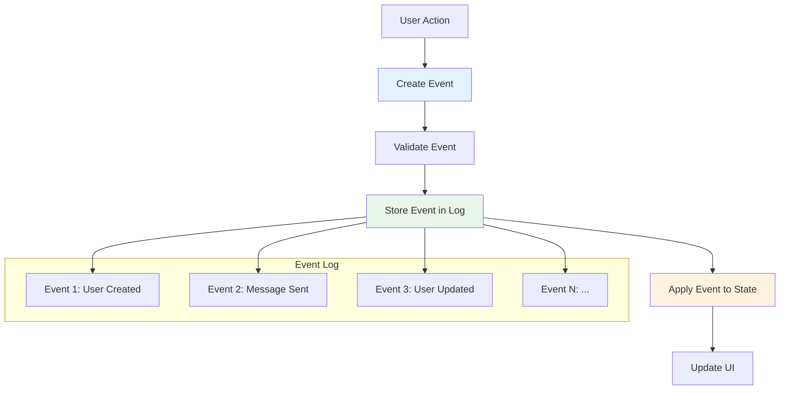
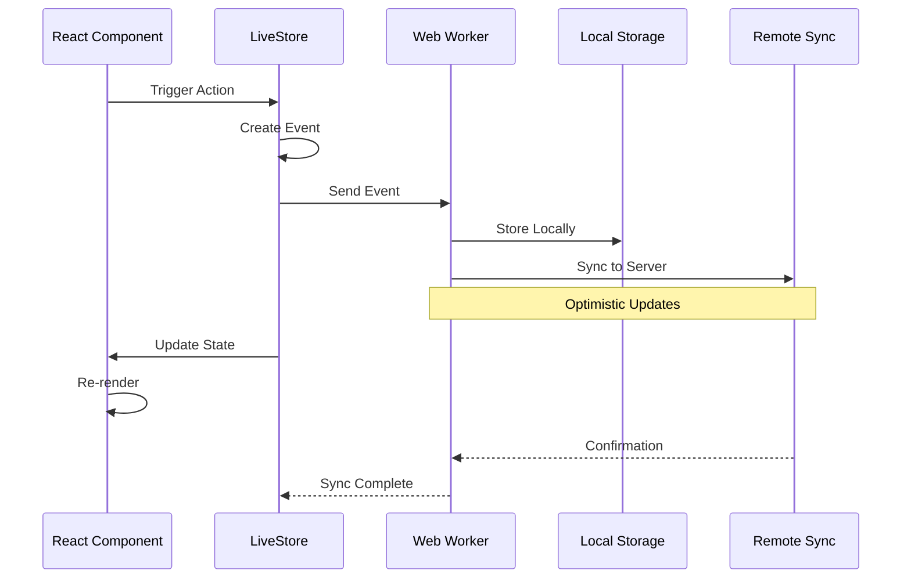
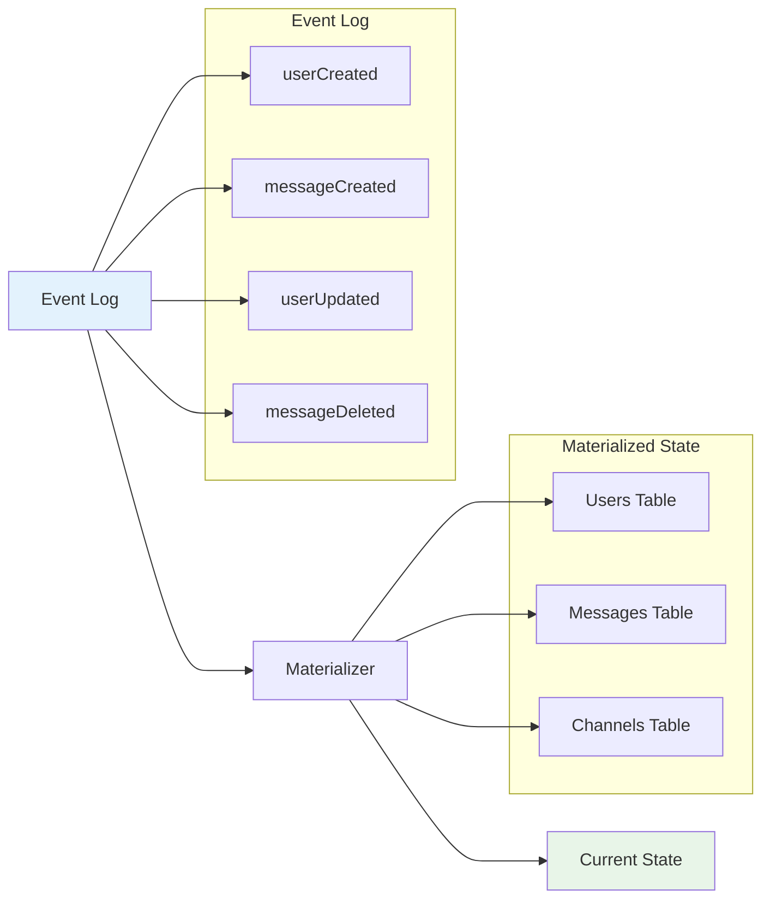
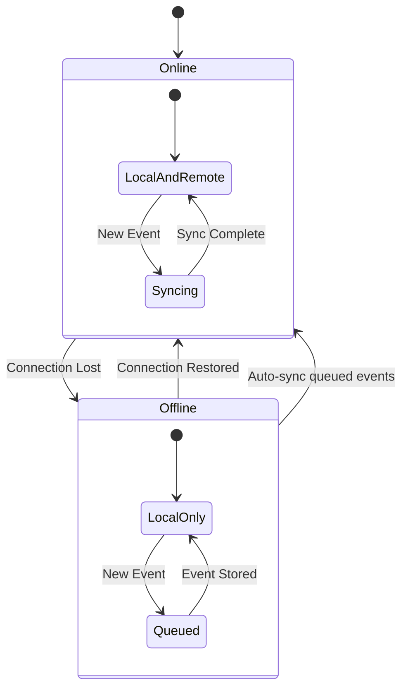
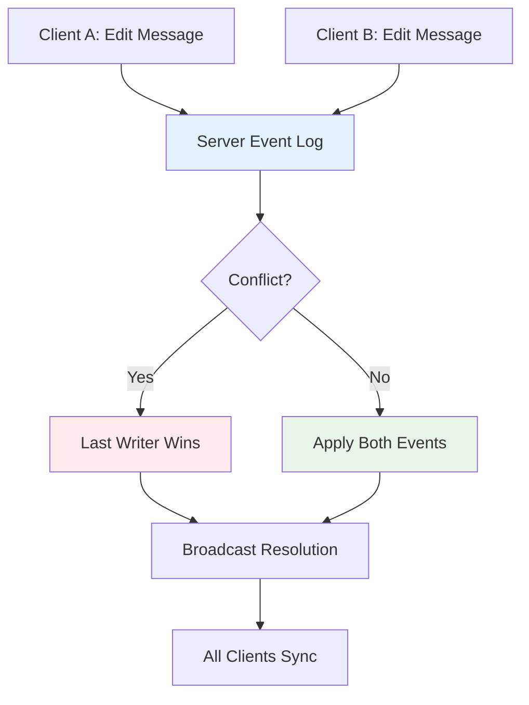

# LiveStore Basics

This document explains the core concepts of LiveStore and how event sourcing works in our application.

## 🎯 What is LiveStore?

LiveStore is a real-time, offline-first state management library that uses event sourcing to maintain consistent state across multiple clients. Think of it as Redux meets Firebase, but with full offline support and conflict-free synchronization.

## 📚 Core Concepts

### Event Sourcing



Instead of directly modifying state, LiveStore records **events** that describe what happened:

```typescript
// ❌ Direct state mutation
user.name = "New Name"

// ✅ Event sourcing
store.commit(events.userUpdated({
  id: "user-123",
  name: "New Name",
  updatedAt: new Date()
}))
```

### Schema Definition

LiveStore uses a schema to define your data structure and events:

```typescript
// packages/livestore/src/schema.ts
export const schema = defineLiveStoreSchema({
  tables: {
    users: table({
      id: field.string(),
      email: field.string(),
      name: field.string(),
      createdAt: field.date(),
      // ... other fields
    }),
    messages: table({
      id: field.string(),
      channelId: field.string(),
      userId: field.string(),
      content: field.string(),
      createdAt: field.date(),
      // ... other fields
    })
  },
  events: {
    userCreated: event({
      id: field.string(),
      email: field.string(),
      name: field.string(),
      createdAt: field.date(),
    }),
    messageCreated: event({
      id: field.string(),
      channelId: field.string(),
      userId: field.string(),
      content: field.string(),
      createdAt: field.date(),
    })
  }
})
```

## 🔄 Event Lifecycle



### Event Types

Events in our application follow specific patterns:

```typescript
// Creation Events
events.userCreated({
  id: generateId(),
  email: "user@example.com",
  name: "John Doe",
  createdAt: new Date()
})

// Update Events  
events.userUpdated({
  id: "existing-user-id",
  name: "Updated Name",
  updatedAt: new Date()
})

// Deletion Events (Soft Delete)
events.userDeleted({
  id: "user-id",
  deletedAt: new Date()
})
```

## 🗃️ State Management

### Queries and Reactivity

LiveStore provides reactive queries that automatically update when data changes:

```typescript
import { queryDb } from '@livestore/livestore'
import { useStore, tables } from '@/lib/livestore'

function ChatMessages({ channelId }: { channelId: string }) {
  const { store } = useStore()
  
  // Define a reactive query
  const messagesQuery = queryDb(() => 
    tables.messages
      .where({ channelId, deletedAt: null })
      .orderBy('createdAt', 'asc')
  )
  
  // Use the query (automatically re-renders when data changes)
  const messages = store.useQuery(messagesQuery)
  
  return (
    <div>
      {messages?.map(message => (
        <div key={message.id}>{message.content}</div>
      ))}
    </div>
  )
}
```

### State Materialization



LiveStore automatically builds the current state from events:

1. **Event Log**: `[userCreated, messageCreated, userUpdated, messageDeleted]`
2. **Materialization**: Events are replayed to build current state
3. **Query Results**: Current state is queried reactively

## 🔧 Working with Actions

We've created helper actions to make event creation easier:

```typescript
// apps/web/src/lib/livestore.tsx
export const actions = {
  createUser: (store, userData) => {
    store.commit(events.userCreated({
      ...userData,
      createdAt: new Date()
    }))
  },
  
  createMessage: (store, messageData) => {
    const id = generateId()
    store.commit(events.messageCreated({
      id,
      ...messageData,
      createdAt: new Date()
    }))
    return id
  },
  
  deleteMessage: (store, id) => {
    store.commit(events.messageDeleted({
      id,
      deletedAt: new Date()
    }))
  }
}
```

Usage in components:

```typescript
function SendMessage({ channelId }: { channelId: string }) {
  const { store } = useStore()
  const [content, setContent] = useState('')
  
  const sendMessage = () => {
    if (content.trim()) {
      actions.createMessage(store, {
        channelId,
        userId: getCurrentUser()?.id,
        content: content.trim()
      })
      setContent('')
    }
  }
  
  return (
    <div>
      <input 
        value={content}
        onChange={(e) => setContent(e.target.value)}
        onKeyDown={(e) => e.key === 'Enter' && sendMessage()}
      />
      <button onClick={sendMessage}>Send</button>
    </div>
  )
}
```

## 🌐 Offline-First Design



### How Offline Works

1. **Local Storage**: All events are stored locally in OPFS SQLite
2. **Optimistic Updates**: UI updates immediately, even offline
3. **Sync Queue**: Events are queued when offline
4. **Auto-Recovery**: When online, queued events sync automatically
5. **Conflict Resolution**: Server handles conflicts using event timestamps

### Example: Offline Message Sending

```typescript
// This works the same whether online or offline
const sendMessage = () => {
  actions.createMessage(store, {
    channelId: "channel-1",
    userId: "user-1", 
    content: "Hello World!"
  })
  // ✅ Message appears in UI immediately
  // ✅ Stored locally in OPFS
  // ✅ Will sync when connection restored
}
```

## 🔀 Conflict Resolution

When multiple clients make changes, LiveStore handles conflicts automatically:



### Conflict Resolution Strategies

1. **Last Writer Wins**: For simple fields like names, descriptions
2. **Additive**: For lists, multiple items can be added
3. **Soft Delete**: Deleted items are marked, not removed
4. **Event Ordering**: Server-assigned timestamps determine order

## 📊 Performance Optimizations

### Batching

```typescript
// Multiple events can be batched
store.commit([
  events.userCreated({ ... }),
  events.messageCreated({ ... }),
  events.channelUpdated({ ... })
])
```

### Efficient Queries

```typescript
// ✅ Efficient: Indexed queries
const activeUsers = store.useQuery(queryDb(() => 
  tables.users.where({ status: 'online', deletedAt: null })
))

// ❌ Inefficient: Full table scans
const activeUsers = store.useQuery(queryDb(() => 
  tables.users.where({ deletedAt: null })
)).filter(user => user.status === 'online')
```

### Memory Management

LiveStore automatically manages memory by:
- **Event Compaction**: Old events are archived
- **State Snapshots**: Periodic full state saves reduce replay time  
- **Lazy Loading**: Only load data when queries request it

## 🛠️ Debugging

### DevTools Integration

```typescript
// Enable devtools in development
const adapter = makePersistedAdapter({
  // ... other config
  devtoolsEnabled: import.meta.env.DEV
})
```

### Event Inspection

All events can be inspected in browser dev tools:

```typescript
// View current store state
console.log(store.query(tables.users))

// View event history  
console.log(store.getEventLog())

// Subscribe to all events
store.subscribe((event) => {
  console.log('New event:', event)
})
```

---

This event-sourced architecture provides powerful benefits: complete audit trails, time-travel debugging, offline support, and automatic conflict resolution. The reactive query system ensures your UI stays in sync with minimal code. 