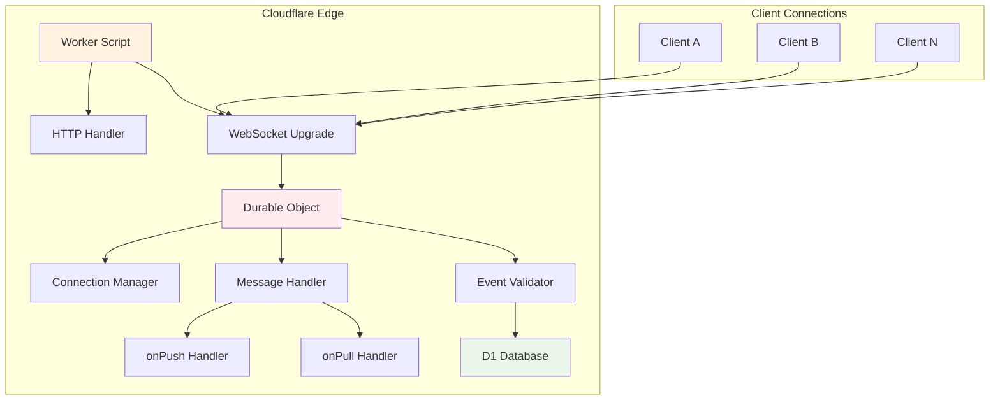
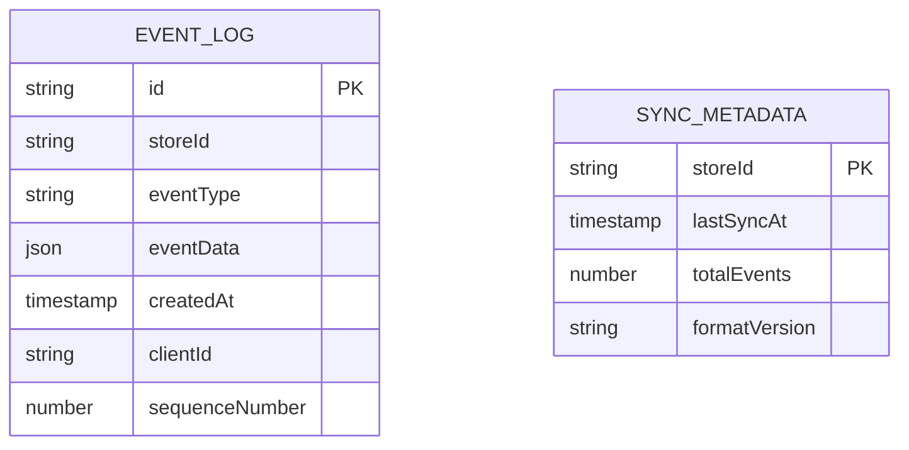
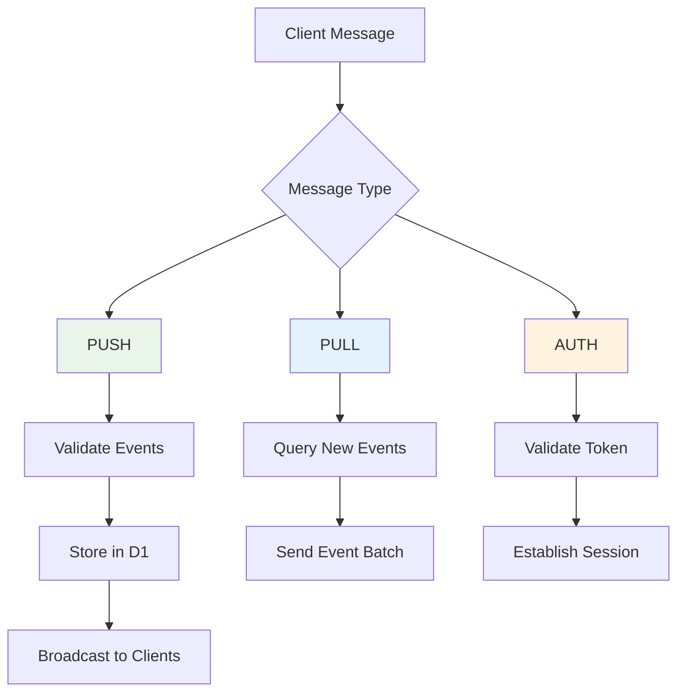

# Sync Worker Setup

This document explains how the Cloudflare Worker sync backend works and how to configure it.

## 🎯 Overview

The sync worker is a Cloudflare Worker that handles real-time synchronization between LiveStore clients using:

- **Cloudflare Workers**: Serverless functions at the edge
- **Durable Objects**: Stateful WebSocket connections
- **D1 Database**: Persistent SQLite storage for events

## 🏗️ Architecture



## 📁 File Structure

```
apps/sync-worker/
├── src/
│   └── index.ts          # Main worker entry point
├── wrangler.toml         # Cloudflare configuration
├── package.json          # Dependencies
├── tsconfig.json         # TypeScript config
├── .dev.vars            # Environment variables
└── README.md            # Setup instructions
```

## ⚙️ Configuration Files

### wrangler.toml

```toml
name = "livestore-sync-worker"
main = "src/index.ts"
compatibility_date = "2024-12-01"
compatibility_flags = ["nodejs_compat"]

[vars]
NODE_ENV = "development"

# Durable Object for WebSocket connections
[[durable_objects.bindings]]
name = "WEBSOCKET_SERVER"
class_name = "WebSocketServer"

# Migration for Durable Objects (required for free plan)
[[migrations]]
tag = "v1"
new_sqlite_classes = ["WebSocketServer"]

# D1 database for event storage
[[d1_databases]]
binding = "DB"
database_name = "livestore-sync"
database_id = "your-database-id"
```

### Environment Variables (.dev.vars)

```bash
LIVESTORE_SECRET=your-secret-key-change-me
AUTH_TOKEN=insecure-token-change-me
NODE_ENV=development
DEBUG=*
```

## 🔧 Worker Implementation

### Main Worker Script

```typescript
// apps/sync-worker/src/index.ts
import { makeDurableObject, makeWorker } from '@livestore/sync-cf/cf-worker'

// Durable Object class for WebSocket connections
export class WebSocketServer extends makeDurableObject({
  onPush: async (message) => {
    console.log('📤 Event pushed:', message.batch)
    
    // Custom logic for when events are pushed to the store
    // Examples:
    // - Send notifications
    // - Trigger webhooks
    // - Log analytics
    // - Validate business rules
  },
  
  onPull: async (message) => {
    console.log('📥 Event pulled:', message)
    
    // Custom logic for when events are pulled from the store
    // Examples:
    // - Rate limiting
    // - Access control
    // - Audit logging
    // - Performance monitoring
  },
}) {}

// Main worker export
export default makeWorker({
  validatePayload: (payload: any) => {
    // Authentication validation
    if (payload?.authToken !== 'insecure-token-change-me') {
      throw new Error('Invalid auth token')
    }
    
    // Additional payload validation
    // Examples:
    // - User permissions
    // - Rate limiting
    // - Input sanitization
    // - Business logic validation
  },
})
```

## 🗄️ Database Schema

The D1 database automatically creates tables for each store:



### Event Storage Pattern

Events are stored in tables following this pattern:
```
eventlog_{PERSISTENCE_FORMAT_VERSION}_{storeId}
```

Example: `eventlog_1_sword-app-global`

## 🔄 Sync Protocol

### WebSocket Message Types



### Message Flow

1. **PUSH (Client → Server)**
   ```json
   {
     "type": "push",
     "events": [
       {
         "id": "event-123",
         "type": "messageCreated",
         "data": { ... },
         "timestamp": "2024-01-01T00:00:00Z"
       }
     ]
   }
   ```

2. **PULL (Client → Server)**
   ```json
   {
     "type": "pull",
     "since": "2024-01-01T00:00:00Z",
     "limit": 100
   }
   ```

3. **BROADCAST (Server → Clients)**
   ```json
   {
     "type": "events",
     "events": [ ... ],
     "timestamp": "2024-01-01T00:00:00Z"
   }
   ```

## 🚀 Deployment

### 1. Create D1 Database

```bash
cd apps/sync-worker
npx wrangler d1 create livestore-sync
```

Update `wrangler.toml` with the database ID returned.

### 2. Deploy to Cloudflare

```bash
# Deploy to production
bun run deploy

# Check deployment status
npx wrangler tail livestore-sync-worker
```

### 3. Environment Variables

Set production environment variables:

```bash
# Set secrets (for production)
npx wrangler secret put LIVESTORE_SECRET
npx wrangler secret put AUTH_TOKEN
```

## 🔧 Local Development

### Start Development Server

```bash
cd apps/sync-worker
bun run dev
```

The worker will be available at:
- **HTTP**: `http://localhost:8787`
- **WebSocket**: `ws://localhost:8787/websocket`

### Database Access

Access the local D1 database:

```bash
# Open local database
npx wrangler d1 execute livestore-sync --local --command "SELECT * FROM sqlite_master"

# View tables
npx wrangler d1 execute livestore-sync --local --command ".tables"
```

Local database file location:
```
.wrangler/state/d1/miniflare-D1DatabaseObject/XXX.sqlite
```

## 🛠️ Customization

### Custom Event Handlers

```typescript
export class WebSocketServer extends makeDurableObject({
  onPush: async (message) => {
    // Custom push handling
    const events = message.batch
    
    // Example: Send notifications for certain events
    for (const event of events) {
      if (event.eventType === 'messageCreated') {
        await sendNotification(event.eventData)
      }
    }
    
    // Example: Validate business rules
    await validateBusinessRules(events)
  },
  
  onPull: async (message) => {
    // Custom pull handling
    const { clientId, storeId } = message
    
    // Example: Rate limiting
    await checkRateLimit(clientId)
    
    // Example: Access control
    await validateAccess(clientId, storeId)
  },
}) {}
```

### Custom Authentication

```typescript
export default makeWorker({
  validatePayload: (payload: any) => {
    // JWT token validation
    const token = payload?.authToken
    if (!token) {
      throw new Error('Missing auth token')
    }
    
    try {
      const decoded = jwt.verify(token, JWT_SECRET)
      // Store user info for later use
      return { userId: decoded.sub }
    } catch (error) {
      throw new Error('Invalid auth token')
    }
  },
})
```

## 📊 Monitoring

### Cloudflare Analytics

Monitor your worker performance:

```bash
# View real-time logs
npx wrangler tail livestore-sync-worker

# View metrics
npx wrangler pages deployment list
```

### Custom Logging

```typescript
export class WebSocketServer extends makeDurableObject({
  onPush: async (message) => {
    // Custom metrics
    console.log(`📊 Events processed: ${message.batch.length}`)
    console.log(`📊 Store: ${message.storeId}`)
    console.log(`📊 Client: ${message.clientId}`)
    
    // Send to external monitoring (e.g., Datadog)
    await fetch('https://api.datadoghq.com/api/v1/events', {
      method: 'POST',
      headers: { 'DD-API-KEY': DATADOG_API_KEY },
      body: JSON.stringify({
        title: 'LiveStore Event',
        text: `Processed ${message.batch.length} events`,
        tags: [`store:${message.storeId}`]
      })
    })
  },
}) {}
```

## 🔒 Security Considerations

### Authentication

- Use strong JWT tokens in production
- Rotate auth tokens regularly
- Implement rate limiting per user
- Validate user permissions for store access

### Input Validation

```typescript
validatePayload: (payload: any) => {
  // Validate payload structure
  if (!payload || typeof payload !== 'object') {
    throw new Error('Invalid payload')
  }
  
  // Sanitize inputs
  if (payload.storeId && !/^[a-zA-Z0-9-_]+$/.test(payload.storeId)) {
    throw new Error('Invalid store ID format')
  }
  
  // Business logic validation
  if (!hasStoreAccess(payload.userId, payload.storeId)) {
    throw new Error('Access denied')
  }
}
```

### Rate Limiting

```typescript
// Implement rate limiting in Durable Object
let requestCounts = new Map()

onPush: async (message) => {
  const clientId = message.clientId
  const count = requestCounts.get(clientId) || 0
  
  if (count > 100) { // 100 requests per minute
    throw new Error('Rate limit exceeded')
  }
  
  requestCounts.set(clientId, count + 1)
  
  // Reset counter every minute
  setTimeout(() => {
    requestCounts.delete(clientId)
  }, 60000)
}
```

## 🐛 Troubleshooting

### Common Issues

1. **Connection Failed**
   ```bash
   # Check worker status
   npx wrangler tail livestore-sync-worker
   
   # Verify auth token
   curl -H "Authorization: Bearer your-token" https://your-worker.workers.dev
   ```

2. **Database Errors**
   ```bash
   # Check D1 database
   npx wrangler d1 execute livestore-sync --command "SELECT name FROM sqlite_master WHERE type='table'"
   ```

3. **Migration Issues**
   ```bash
   # Apply migrations
   npx wrangler d1 migrations apply livestore-sync
   ```

### Debug Mode

Enable debug logging:

```typescript
// Set DEBUG=* in .dev.vars
export class WebSocketServer extends makeDurableObject({
  onPush: async (message) => {
    if (process.env.DEBUG) {
      console.log('🐛 Debug - Push message:', JSON.stringify(message, null, 2))
    }
  },
}) {}
```

---

The sync worker provides a robust, scalable backend for LiveStore synchronization. The Durable Objects ensure strong consistency while D1 provides persistent storage with automatic scaling. 