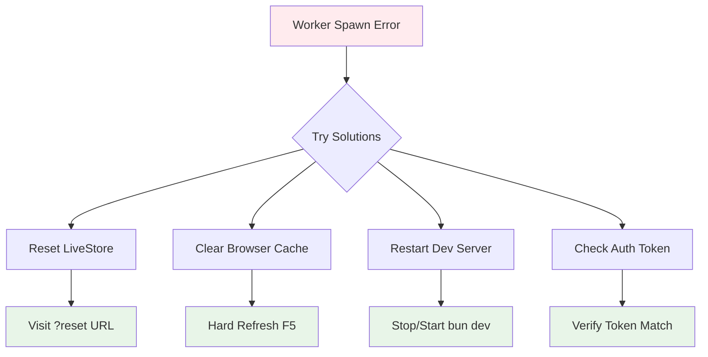
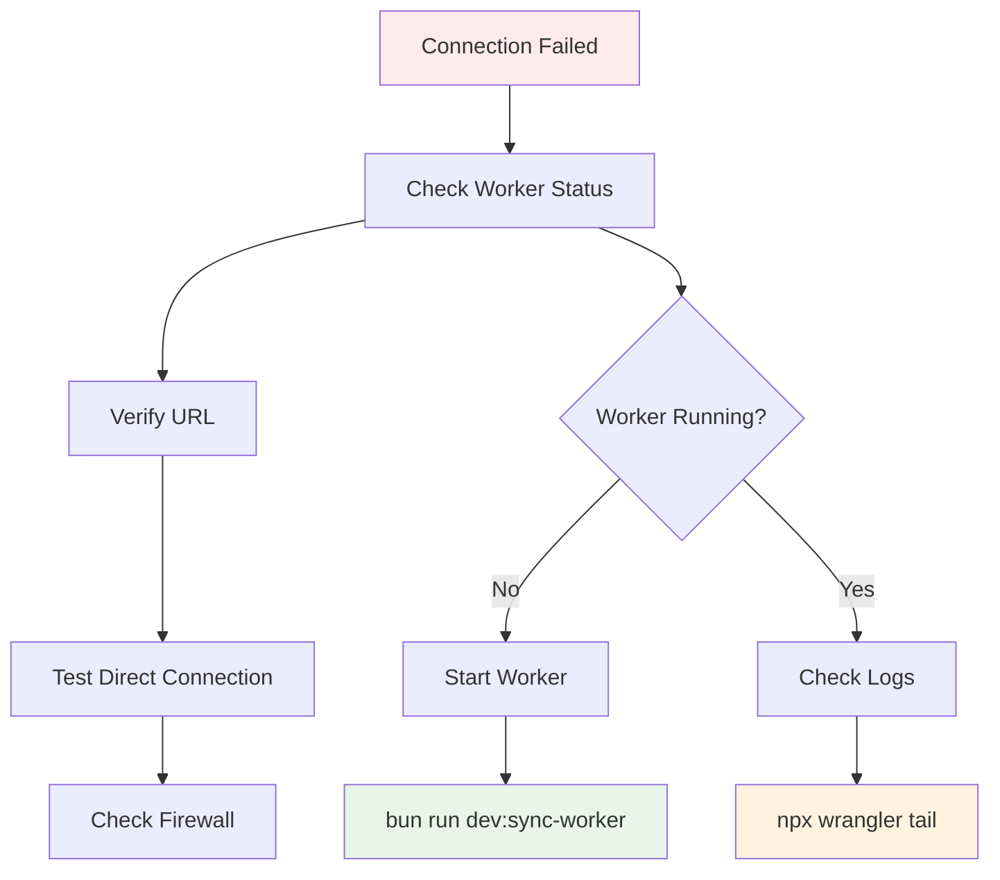
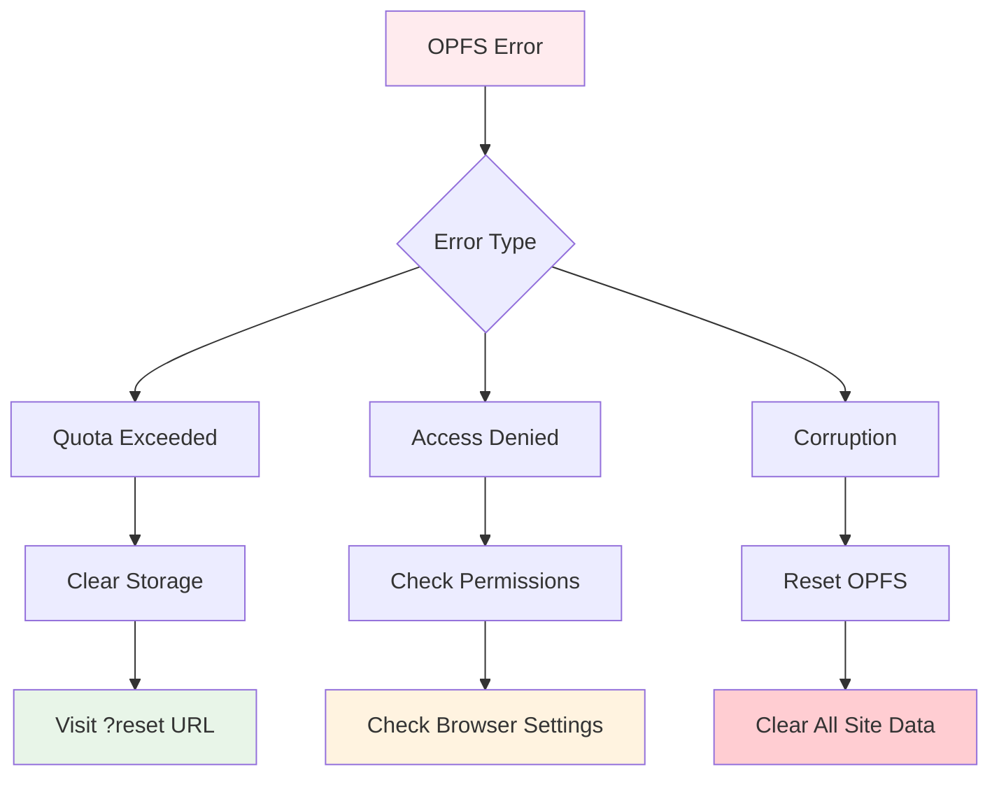

# Troubleshooting Guide

This document covers common issues and solutions when working with the LiveStore sync system.

## 🚨 Common Issues

### 1. Worker Spawning Errors

**Error Message:**
```
WorkerError: An error occurred while spawning a worker
Initial message already sent and was different now
```

**Cause:** Shared worker state collision between browser tabs or hot reloads.

**Solutions:**



#### Quick Fix
1. **Visit reset URL**: `http://localhost:3001?reset`
2. **Remove ?reset** from URL after page loads
3. **Hard refresh** the page (Ctrl+F5 / Cmd+Shift+R)

#### Manual Reset
```typescript
// Emergency reset in browser console
localStorage.clear()
sessionStorage.clear()
if ('serviceWorker' in navigator) {
  navigator.serviceWorker.getRegistrations().then(function(registrations) {
    for(let registration of registrations) {
      registration.unregister()
    }
  })
}
location.reload()
```

### 2. Auth Token Mismatch

**Error Message:**
```
Error: Invalid auth token
syncPayload: { authToken: 'dev-token-change-me' }
Expected: 'insecure-token-change-me'
```

**Fix:** Ensure auth tokens match between client and server:

```typescript
// ✅ Client (apps/web/src/lib/livestore.tsx)
syncPayload={{ authToken: 'insecure-token-change-me' }}

// ✅ Server (apps/sync-worker/.dev.vars)
AUTH_TOKEN=insecure-token-change-me

// ✅ Server (apps/sync-worker/src/index.ts)
if (payload?.authToken !== 'insecure-token-change-me') {
```

### 3. Sync Worker Connection Failed

**Error Message:**
```
WebSocket connection failed
Failed to connect to ws://localhost:8787
```

**Debugging Steps:**



#### Check Worker Status
```bash
# 1. Verify worker is running
curl http://localhost:8787
# Should return: 200 OK (or error about invalid path)

# 2. Check WebSocket endpoint
curl -i -N -H "Connection: Upgrade" \
  -H "Upgrade: websocket" \
  -H "Sec-WebSocket-Key: test" \
  -H "Sec-WebSocket-Version: 13" \
  http://localhost:8787/websocket

# 3. View worker logs
cd apps/sync-worker && npx wrangler tail
```

### 4. Database Errors

**Error Message:**
```
D1_ERROR: table eventlog_1_sword-app-global doesn't exist
```

**Cause:** Database not initialized or migration issues.

**Fix:**
```bash
# Check database exists
npx wrangler d1 list

# Check tables in database
npx wrangler d1 execute livestore-sync --local \
  --command "SELECT name FROM sqlite_master WHERE type='table'"

# If no tables, the worker will create them automatically on first use
```

### 5. Port Conflicts

**Error Message:**
```
Error: listen EADDRINUSE: address already in use :::8787
```

**Solutions:**

```bash
# 1. Find process using port
lsof -ti:8787

# 2. Kill the process
kill -9 $(lsof -ti:8787)

# 3. Use different port
npx wrangler dev --port 8788

# 4. Update client to use new port
# In apps/web/src/lib/livestore.worker.ts
const syncUrl = 'ws://localhost:8788'
```

### 6. OPFS Storage Issues

**Error Message:**
```
Failed to initialize OPFS storage
QuotaExceededError: Storage quota exceeded
```

**Solutions:**



#### Clear OPFS Storage
```typescript
// Run in browser console
navigator.storage.estimate().then(estimate => {
  console.log('Storage used:', estimate.usage, 'of', estimate.quota)
})

// Clear OPFS data
if ('storage' in navigator && 'getDirectory' in navigator.storage) {
  navigator.storage.getDirectory().then(async (dir) => {
    for await (const [name, handle] of dir.entries()) {
      await dir.removeEntry(name, { recursive: true })
    }
    console.log('OPFS cleared')
  })
}
```

## 🔧 Development Issues

### Hot Reload Problems

**Issue:** Changes don't reflect or cause errors.

**Solutions:**
```bash
# 1. Restart development servers
pkill -f "bun.*dev"
bun run dev

# 2. Clear Vite cache
rm -rf node_modules/.vite
bun run dev

# 3. Reset LiveStore completely
# Visit: http://localhost:3001?reset
```

### TypeScript Errors

**Issue:** Type mismatches in LiveStore schema.

**Common Fixes:**
```typescript
// ✅ Ensure event types match table fields
events.userCreated({
  id: field.string(),        // Must match table
  email: field.string(),     // Must match table
  createdAt: field.date(),   // Must match table
})

// ✅ Use proper field types
field.string()     // For strings
field.number()     // For numbers  
field.date()       // For dates
field.boolean()    // For booleans
field.json()       // For objects/arrays
```

### Performance Issues

**Issue:** Slow queries or UI freezing.

**Debugging:**
```typescript
// Profile queries
const start = performance.now()
const result = store.useQuery(messagesQuery)
console.log('Query time:', performance.now() - start, 'ms')

// Check query efficiency
const inefficientQuery = queryDb(() => 
  tables.messages.where({ deletedAt: null })
    .filter(m => m.channelId === channelId) // ❌ Inefficient
)

const efficientQuery = queryDb(() => 
  tables.messages.where({ 
    channelId, 
    deletedAt: null 
  }) // ✅ Efficient - uses index
)
```

## 🌐 Production Issues

### Deployment Failures

**Error:** Wrangler deployment fails.

```bash
# Check account and permissions
npx wrangler whoami

# Verify configuration
npx wrangler config list

# Deploy with verbose output
npx wrangler deploy --compatibility-date=2024-12-01 --verbose
```

### Durable Object Limits

**Error:** Exceeded Durable Object limits.

**Free Plan Limits:**
- 1 Durable Object class
- 1 instance per class
- Limited storage

**Solutions:**
```toml
# Use new_sqlite_classes for free plan
[[migrations]]
tag = "v1"
new_sqlite_classes = ["WebSocketServer"]

# Not new_classes (paid plan only)
```

### D1 Database Issues

**Error:** Database query failures in production.

```bash
# Check D1 status
npx wrangler d1 info livestore-sync

# View database content
npx wrangler d1 execute livestore-sync \
  --command "SELECT COUNT(*) FROM sqlite_master"

# Check for long-running queries
npx wrangler d1 execute livestore-sync \
  --command "PRAGMA table_info(your_table_name)"
```

## 🛠️ Debug Tools

### Browser DevTools

```typescript
// Access LiveStore debug info
window.__LIVESTORE_DEBUG__ = {
  store: store,
  events: events,
  tables: tables,
  query: (q) => store.query(q)
}

// In console:
__LIVESTORE_DEBUG__.query(tables.messages)
```

### Worker Debugging

```typescript
// Enhanced logging in worker
export class WebSocketServer extends makeDurableObject({
  onPush: async (message) => {
    console.group('📤 PUSH Event')
    console.log('Store ID:', message.storeId)
    console.log('Client ID:', message.clientId)
    console.log('Events:', message.batch.length)
    console.table(message.batch)
    console.groupEnd()
  },
}) {}
```

### Network Debugging

```bash
# Monitor WebSocket traffic
npx wrangler tail livestore-sync-worker --format=pretty

# Test WebSocket connection manually
wscat -c ws://localhost:8787/websocket

# Check network requests
curl -v http://localhost:8787
```

## 📊 Monitoring Setup

### Client-Side Monitoring

```typescript
// Error tracking
store.subscribe((event, error) => {
  if (error) {
    console.error('LiveStore error:', error)
    // Send to error tracking service
    Sentry.captureException(error, {
      tags: { component: 'livestore' },
      extra: { event }
    })
  }
})

// Performance monitoring
const queryObserver = new PerformanceObserver((list) => {
  for (const entry of list.getEntries()) {
    if (entry.name.includes('livestore')) {
      console.log('LiveStore performance:', entry)
    }
  }
})
queryObserver.observe({ entryTypes: ['measure'] })
```

### Server-Side Monitoring

```typescript
// Custom metrics in worker
export class WebSocketServer extends makeDurableObject({
  onPush: async (message) => {
    // Track metrics
    const metrics = {
      timestamp: Date.now(),
      storeId: message.storeId,
      eventCount: message.batch.length,
      clientId: message.clientId
    }
    
    // Send to monitoring service
    await fetch('https://api.monitoring-service.com/metrics', {
      method: 'POST',
      body: JSON.stringify(metrics)
    })
  },
}) {}
```

## 🚀 Recovery Procedures

### Complete Reset

```bash
# 1. Stop all services
pkill -f "bun.*dev"

# 2. Clear all caches
rm -rf node_modules/.vite
rm -rf .turbo
rm -rf apps/sync-worker/.wrangler

# 3. Reset LiveStore
# Visit: http://localhost:3001?reset

# 4. Restart everything
bun install
bun run dev
```

### Data Recovery

```bash
# Backup local OPFS data (if possible)
# This requires manual extraction via browser DevTools

# Reset to last known good state
npx wrangler d1 execute livestore-sync \
  --command "SELECT * FROM eventlog_1_sword-app-global ORDER BY createdAt DESC LIMIT 10"
```

## 📞 Getting Help

### Debug Information Checklist

When reporting issues, include:

- [ ] Browser and version
- [ ] Error messages (full stack trace)
- [ ] Steps to reproduce
- [ ] LiveStore version
- [ ] Worker deployment status
- [ ] Network connectivity
- [ ] Auth token configuration

### Useful Commands

```bash
# System info
bun --version
node --version
npx wrangler --version

# LiveStore info
cat packages/livestore/package.json | grep version
grep -r "AUTH_TOKEN" apps/

# Worker status
npx wrangler tail livestore-sync-worker --format=pretty
curl -I http://localhost:8787
```

---

Most issues can be resolved by resetting LiveStore state or restarting services. The system is designed to be resilient and self-healing. 